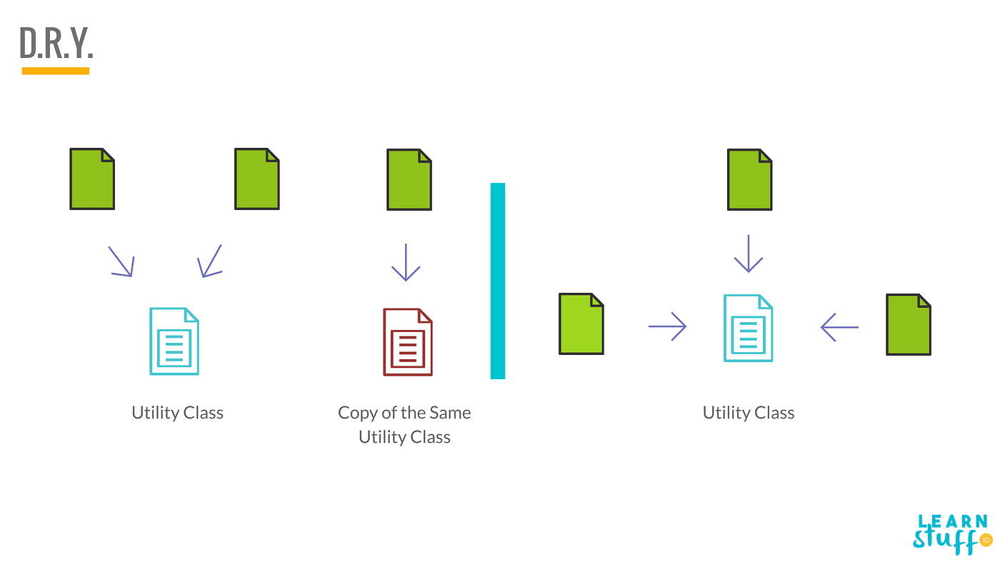

# Don't Repeat Yourself (DRY) Principle

> <mark style="color:green;">**"Every piece of knowledge must have a single, unambiguous, authoritative representation within a system."**</mark>

The DRY principle – **"Don't Repeat Yourself"** is one of the fundamental principles for writing code that is not only functional but also efficient and maintainable. It encourages to minimise redundancy and write code that does one thing well.

<figure><figcaption></figcaption></figure>

### **Key Benefits of the DRY Principle**

* **Reduced Duplication**: Eliminates repetitive code, streamlining the system.
* **Improved Reusability**: DRY code is more modular and flexible and modular code is easier to reuse and adapt.
* **Simplified Bug Fixes**: Fixing issues in one place resolves them system-wide.
* **Enhanced Consistency**: Prevents discrepancies caused by duplicated code.
* **Faster Development**: Reusing code speeds up the process.

### Implementing the DRY Principle

* **Identify Repetitive Code:**  Look for patterns, similar logic, or functionality that appears in multiple places.
* **Extract Common Functionality:** Extract the common functionality into reusable components, such as functions, classes, or modules.

<figure><figcaption></figcaption></figure>

* **Use Inheritance and Composition:** By creating a hierarchy of classes or composing objects together, you can avoid duplicating code and promote code reuse.
* **Leverage Libraries and Frameworks:** Instead of reinventing the wheel, leverage libraries and frameworks to avoid writing repetitive code.&#x20;
* **Refactor Regularly:** It's important to regularly review and refactor code to eliminate any new instances of duplication.

### When to Avoid Applying the DRY Principle

The DRY principle is a guideline, not a hard-and-fast rule.

* **Premature Abstraction**: Trying to apply DRY too early in the development process might lead to over-engineering.
* **Performance-critical code**: In some cases, duplicating code can be faster than calling a reusable function, especially if the function has a high overhead or is not inlined.
* **Sacrificing Readability**: If the duplicated code is very simple and easy to understand, it might be better to leave it as is, rather than creating a complex abstraction.
* **One-time usage**: If a piece of code is only used once, it might not be worth extracting into a reusable function.
* **Legacy code or technical debt**: If working with legacy code or technical debt, it might be more practical to duplicate code temporarily, rather than trying to refactor the entire system.
* **Debugging and testing**: In some cases, duplicating code can make it easier to debug and test, as it allows for more isolation and control.

### Reference&#x20;

* [The DRY Principle](https://blog.algomaster.io/p/082450d8-0e7b-4447-a8dc-b7308e45f048)
* [DRY: Do not repeat yourself](https://medium.com/@learnstuff.io/dry-do-not-repeat-yourself-8518055b4cf)

