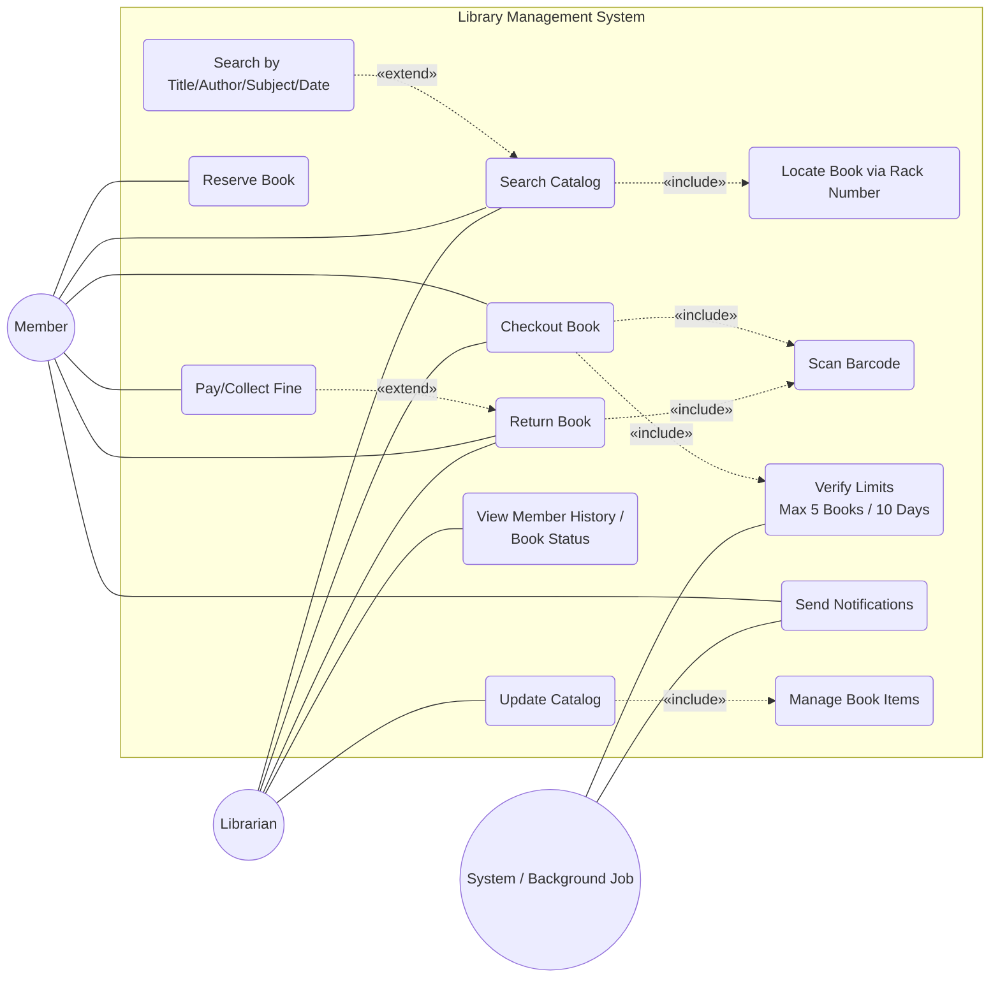
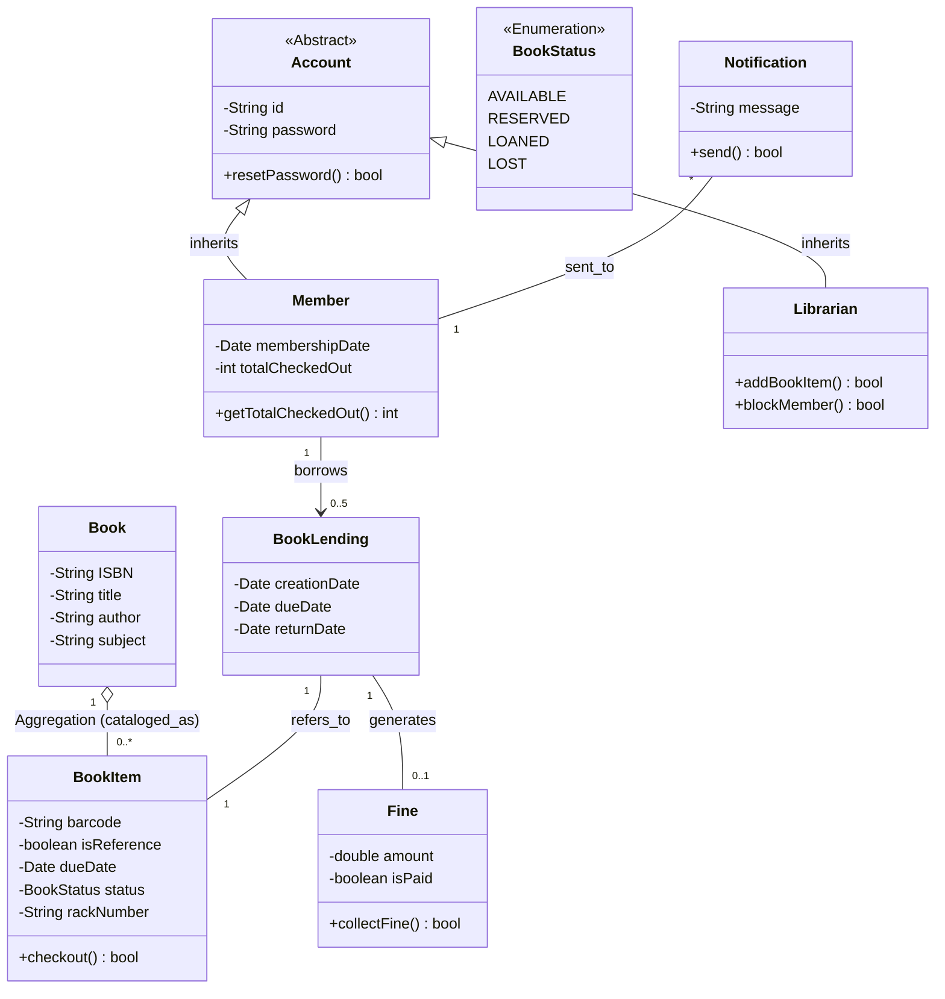
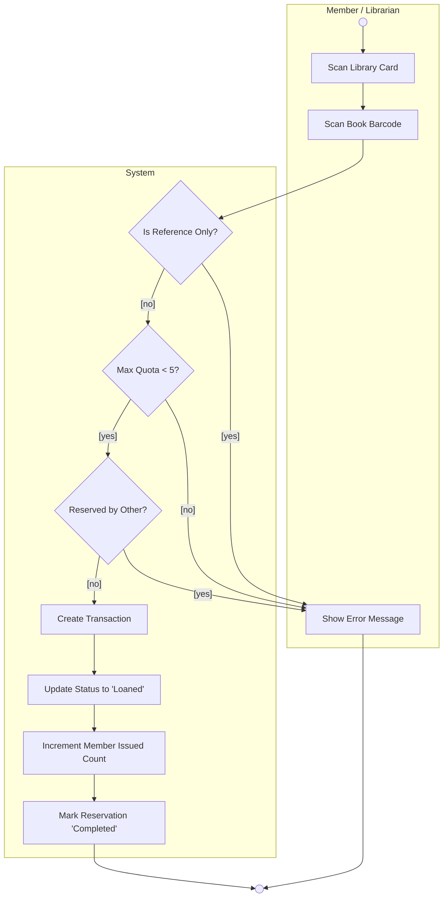
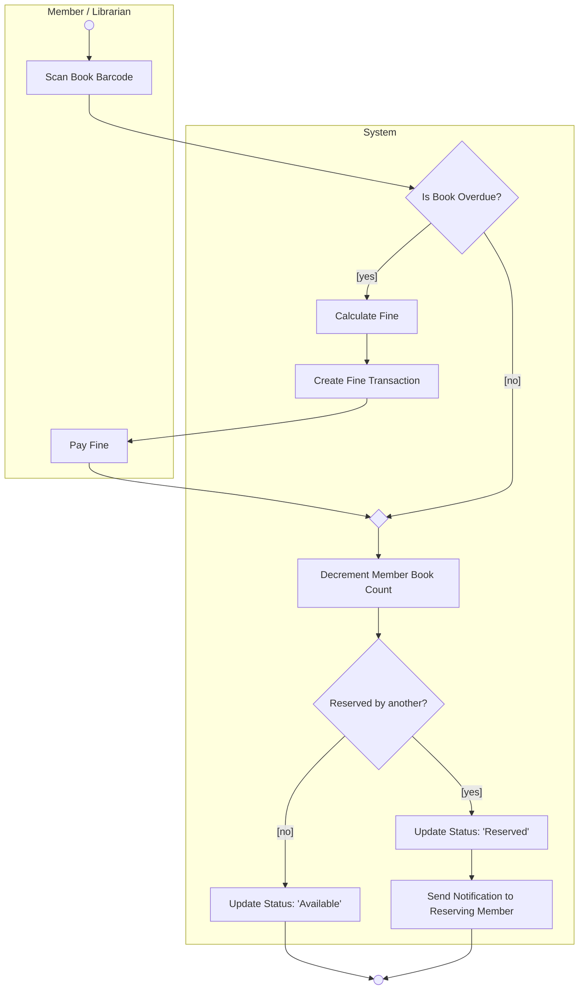

# Design a Library Management System (LMS)

A Library Management System (LMS) is a specialized resource management platform designed to track book inventory, manage member lifecycle (subscriptions/profiles), and orchestrate the checkout/return workflow.

---

## 1. System Requirements

The following functional requirements form the architectural baseline for the system. In Low-Level Design (LLD), these are typically identified through "Noun-Verb" extraction.

| ID         | Requirement                                                                                  | Category     |
| :--------- | :------------------------------------------------------------------------------------------- | :----------- |
| **REQ-1**  | Members must be able to search books by title, author, subject, or publication date.         | Search       |
| **REQ-2**  | Each book has a unique ID and a physical rack number for localization.                       | Inventory    |
| **REQ-3**  | Support for multiple copies of a book (referred to as **Book Items**).                       | Inventory    |
| **REQ-4**  | Retrieve audit trails: who took a particular book or books checked-out by a specific member. | Audit        |
| **REQ-5**  | Maximum limit of **5 books** per member.                                                     | Constraint   |
| **REQ-6**  | Maximum loan duration of **10 days**.                                                        | Constraint   |
| **REQ-7**  | Collect fines for books returned after the due date.                                         | Transaction  |
| **REQ-8**  | Support for reserving currently unavailable books.                                           | Reservation  |
| **REQ-9**  | Automated notifications for availability and overdue warnings.                               | Notification |
| **REQ-10** | Unique barcodes for both books and member cards for hardware integration.                    | Hardware     |

---

## 2. Use Case Modeling

The Use Case diagram defines the system boundary and the interactions between human actors and automated triggers.

### Use Case Diagram

Creating a professional-grade Use Case diagram requires shifting from a "list of features" to a "model of goals."

#### Step 1: The "Who" - Actor Identification (Noun Hunt)

Identify everyone or everything *outside* the system that needs to talk to it.
* **Action**: Circle every person (Librarian, Member) and every external system (Payment Gateway, SMS Server) in your requirements.
* **Rule**: Actors are **roles**, not specific people. Use "Member," not "John Doe."

Read your requirements and identify every entity that interacts with the software

- **Primary Actors**: Humans who initiate an interaction to achieve a goal (e.g., *Member*, *Librarian*).
- **Secondary Actors**: External systems, databases, or automated triggers (e.g., *Email Server*, *Payment Gateway*, *System Timer*).

#### Step 2: The "What" (Use Cases) -  Goal Extraction (Verb Hunt)

Identify the **goals** the actors want to achieve. Look for major actions that provide a "result of value" to an actor.

* **Action**: Underline the main verbs.
* **The "So What?" Test**: If an action doesn't provide a result of value, it's a step, not a use case.
    * ❌ *Enter Username* (So what? I'm not logged in yet).
    * ✅ *Login to System* (Now I have access).

#### Step 3: The "Where" (System Boundary) - Define the System Boundary

Define the scope of your software.

* **Action**: Draw a large box.
* **Rule**: Bubbles go **inside**; Actors stay **outside**. This visualizes what your team is actually building versus what already exists in the world.

#### Step 4: The "Wiring" (Relationships)

Connect the actors to the bubbles and define how bubbles relate to each other.

* **Solid Line**: Simple interaction.
* **Dashed Arrow**: Logic dependency (`«include»` or `«extend»`).

#### Step 5: Traceability Audit
Point to each requirement in your documentation. Can you find a corresponding bubble or relationship in your diagram? If not, the design is incomplete.

### Strategic Best Practices: Use Case Design

In UML, a use case must be an **action** that provides a **result of value**. 

#### I. The Actor Association Rule

The most common error in UML is the "floating actor."

* **Rule:** Every actor must be connected by a solid line (**Association**) to at least one use case.
* **Logic:** An unconnected actor implies the system has no interface for that user's role.
* **Best Practice:** Distinguish between the **primary actor** (initiator) and the **secondary actor** (supporting system/recipient).

#### II. Use Case vs. Business Rule

* **Avoid "Static" Bubbles:** Do not create bubbles for constraints like "Maximum 5 books allowed."
* **The "Verb-Noun" Test:** Start every use case with a verb. 
    * *Incorrect:* "10-day loan limit."
    * *Correct:* "Verify Checkout Limits."
* **Where Rules Live:** Document rules in the use case description or show them as validation steps (`<<include>>`).

#### III. Mastering Relationship Logic
The direction of arrows defines the dependency of the underlying code.

| Relationship  | Logic                              | Arrow Direction                     | Example                              |
| :------------ | :--------------------------------- | :---------------------------------- | :----------------------------------- |
| `<<include>>` | **Mandatory** dependency.          | **Away** from base toward sub-task. | *Checkout* $\to$ *Scan Barcode*      |
| `<<extend>>`  | **Optional/Conditional** behavior. | **Back** toward the base use case.  | *Calculate Fine* $\to$ *Return Book* |

---

## 3. Class Diagram & Domain Modeling

The class diagram serves as the "Blueprint" for the system's memory and data structure.

### Domain Model (Class Diagram)

#### Step 1: Noun Hunt (Entities)
Identify every person, place, or concept the system must "remember." *LMS Example*: Book, Member, Fine, Rack, Reservation.

!!! tip "Concept vs. Instance (The 'Book' Mistake)"
    This is the most frequent error in Library Systems.

    * **The Lesson:** A **Book** is the metadata (Title, Author, ISBN). A **BookItem** is the physical object (Barcode, Rack Number). 
    * **Why it matters:** If you put the barcode in the `Book` class, every copy of "The Great Gatsby" would share the same barcode, making individual checkouts impossible.

#### Step 2: Attribute & Method Definition

- **Attributes**: What data does it hold? (e.g., `ISBN`, `dueDate`).
- **Methods**: What can it do? (e.g., `calculateFine()`, `updateStatus()`).

#### Step 3: Relationship Mapping 

Determine how classes interact. This is the "logic" of your architecture.

=== "Inheritance (Generalization)"
    Used for "Is-A" logic.

    * **Symbol**: Solid line with an empty triangle arrow.
    * **Example**: A `Librarian` **is an** `Account`.

=== "Aggregation (White Diamond)"
    Used for "Has-A" logic where parts can exist independently.

    * **Symbol**: Solid line with a white diamond on the parent side.
    * **Example**: A `Book` has `BookItems`. If the catalog entry is deleted, the physical book still exists.

=== "Composition (Black Diamond)"
    Used for "Has-A" logic where parts **cannot** exist without the parent.

    * **Symbol**: Solid line with a black diamond on the parent side.
    * **Example**: An `Account` owns a `LibraryCard`. If the account is deleted, the card is voided.

#### Step 4: Multiplicity Audit
Add numbers (1, 0..*, 1..5) to define business constraints at the structural level.
  

### Critical LLD Insights

??? info "Inheritance (IS-A) vs. Association (HAS-A)"
    * **Generalization:** Use only when one thing is a specialized version of another (e.g., `Librarian` is an `Account`).
    * **Association:** Use when one thing "uses" or "belongs to" another (e.g., `Member` borrows `BookLending`).

??? tip "State Management with Enums"
    Don't use strings for status. Instead of `String status = "Available"`, use an **Enumeration**. This prevents typos (e.g., "Availabe") from breaking system logic.

---

## 4. Activity Diagrams: Process Flows

Activity Diagrams are high-level flowcharts used to model the business logic of a specific use case (e.g., "Returning a Book").

!!!important "swimlanes"
    Activity diagrams utilize **Swimlanes (Partitions)** to clarify who is responsible for specific actions.

### Activity Diagram

#### Step 1 : The Trigger
Identify the **Initial Node** (solid black circle). What starts the process?

#### Step 2 : Swimlanes (Partitions)
Divide the diagram into columns to show **Who** is doing **What** (e.g., Member vs. System).

#### Step 3 : The Happy Path
Map the straight-line sequence where everything goes perfectly.

!!! info "Action vs. State"
    * ❌ **Incorrect**: A box labeled "Book is Loaned." (This is a state).
    * ✅ **Correct**: A box labeled "Update status to Loaned." (This is an **Action**).

#### Step 4 : Decision Diamonds 
Add branching logic for errors or conditions (e.g., "Is the book overdue?").

!!! warning "Decision Guards"
    Every arrow leaving a diamond **must** have a guard condition in square brackets, such as `[yes]` or `[no]`. This ensures the logic is mutually exclusive.

#### Step 5 : Merge & Terminate 
Consolidate paths back together and end at the **Final Node** (bullseye).
  

### I. Check-out Process

### II. Return Process

---

## 5. Architectural Quality Checklists

### Activity Diagram "Cheat Sheet"
* **Action vs. State:** Boxes represent Actions (Verbs). Use "Update status to Loaned," not "Book is Loaned."
* **Decision Guards:** Every path out of a diamond must have a `[guard condition]`. This ensures logic is mutually exclusive.
* **Background Tasks (Req 9):** Notifications for overdue books are not part of the Return diagram. They are triggered by a **Timer Event** or "Overdue Monitor" background job.
* **Merge Nodes:** Use a diamond to merge multiple paths back into a single flow to keep the diagram clean.

### Final Class Diagram Review
1.  **Traceability:** Can I find every requirement (e.g., the 10-day limit)?
2.  **Orphans:** Are there any classes with no lines connecting them?
3.  **Composition Direction:** The diamond must sit on the **Container/Parent** side.
4.  **Single Responsibility:** Does each class do one thing? If a `Member` class is managing the catalog, break it up.
5.  **Interfaces:** Use interfaces for pluggable logic (e.g., `ISearchStrategy` for Local vs. Global search).

---

## 6. Implementation Workflows

=== "Requirements to Use Case"
    1.  **Noun/Verb Extraction:** Member/Librarian (Nouns), Search/Borrow (Verbs).
    2.  **System Boundary:** Draw the box. Humans on the Left, Automated Systems on the Right.
    3.  **Happy Path:** Map the core successful actions first.
    4.  **Logic Layers:** Add `<<include>>` for shared steps and `<<extend>>` for exceptions.
    5.  **Audit:** Point to each requirement and find its bubble.

=== "Requirements to Class Diagram"
    1.  **Identity Identification:** If the system "remembers" it, it's a **Class**.
    2.  **Relationship Mapping:** Connect nouns with verbs (Member borrows Book).
    3.  **State & Behavior:** ISBN/dueDate (Attributes), `checkout()` (Methods).
    4.  **Multiplicity:** Ask "How many A's per B?" (1 Member to 0..5 Books).

=== "Design to Activity Diagram"
    1.  **Trigger:** Identify the event (Initial Node).
    2.  **Swimlanes:** Define the players (Member, Librarian, System).
    3.  **Happy Path:** Draw the straight line to success.
    4.  **Edge Cases:** Add Decision Diamonds for "What-Ifs" (Late, Damaged, Quota exceeded).
    5.  **Merge & Finalize:** Connect all paths to the Final Node.