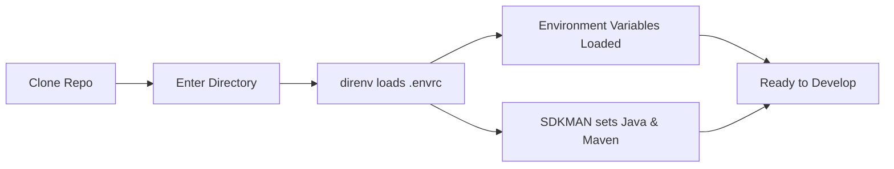

# The Java Dev Environment That Just Works

Setting up a Java project shouldn’t take hours, involve outdated wikis, or require tribal knowledge.

This setup gives you a development environment that works the moment you clone the repo — no guesswork, no manual installs, no surprises.


## What We Want

- Same Java and Maven versions  
- Same environment variables  
- Same commands  

> Clone → setup → start coding


## The Big Picture




## Install the Basics

=== "macOS"
    ```bash
    brew install direnv go-task
    ```

=== "Linux (Debian/Ubuntu)"
    ```bash
    sudo apt update
    sudo apt install direnv
    sh -c "$(curl --location https://taskfile.dev/install.sh)" -- -d
    ```

Install SDKMAN:

```bash
curl -s "https://get.sdkman.io" | bash
source "$HOME/.sdkman/bin/sdkman-init.sh"
```


## Tools

### Environment Variables with `dotenv`

We separate config from code:

- `.env.shared` → team-wide config  
- `.env` → local secrets  

```bash
DATABASE_PASSWORD=supersecret
STRIPE_API_KEY=pk_test_123
MICRONAUT_ENVIRONMENTS=dev
```


### Lock Java & Maven Versions `SDKMAN`

It ensures that every developer is using the exact same version of Maven and the JDK, which is the core of your Java work.


```shell
java=21.0.2-open
maven=3.9.6
```

```bash
sdk env install
sdk env
```


### Automatic Environment Loading `direnv`

It watches your terminal. As soon as you `cd` into your project, it executes the `.envrc` file. This loads the `devenv` shell and any environment variables into your current terminal session.

```bash
dotenv .env.shared

if [ -f .env ]; then
  dotenv
fi

if has sdk; then
  sdk env
fi
```

!!! warning
    Run `direnv allow` once after cloning.


### Standard Commands with [`task`](https://taskfile.dev/)

Instead of typing complex commands you just type `task <cmd>`.

```yaml
version: '3'

tasks:
  setup:
    desc: Install dependencies and initialize environment
    cmds:
      - sdk env install
      - direnv allow

  clean:
    desc: Clean build artifacts
    cmds:
      - ./mvnw clean
```

Run commands like:

```bash
task clean
```

### Lefthook and EditorConfig

These prevent "pollution" of the codebase.

- EditorConfig tells IntelliJ or VS Code syntax.
- Lefthook acts as a final gate.


## Key Files

| File           | Purpose                |
| -------------- | ---------------------- |
| `.sdkmanrc`    | Java & Maven versions  |
| `.env`         | Local variables        |
| `.env.shared`  | Shared variables       |
| `.envrc`       | Environment automation |
| `Taskfile.yml` | Commands               |


## Why This Works

This setup removes friction:

- No manual setup  
- No version mismatches  
- No hidden configuration  

> You spend time building, not debugging your environment.
