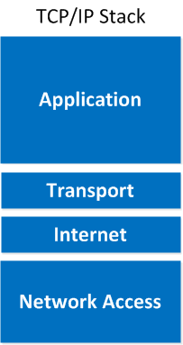

# TCP/IP

For all the Internet communications, the TCP/IP Stack is used to show the different protocols used to format data to enable its transmission between computers.

!!! note ""
    A protocol is a set of rules required for two computers to communicate over a network.
    A layer is a group of protocols focusing one one stage of the data transmission.

The TCP/IP stack consists of 4 layers

- Application Layer
- Transport Layer
- Internet Layer
- Network Layer

!!! note ""
    The OSI model was designed as a theoretical framework to standardize networking functionality, while the TCP/IP model evolved organically alongside the development of the Internet. While the OSI model offers a clean and pedagogically handy abstraction with seven discrete layers, the TCP/IP suite remains the de facto standard in modern networking due to its real-world applicability.

    

## Application Layer

> Encapsulates OSI Layers 5–7 (Session, Presentation, and Application)

The application layer is used to format the data so that it can be processed by the application being used for the communication. 

- HTTP and HTTPS protocols are used to access a webpage via a web-browser
- The SMTP protocol is used to send e-mails between mail servers
- The IMAP and POP3 protocols are used to retrieve emails from a mail server
- The FTP protocol is used to transfer files between two computers

## Transport Layer

> Directly maps to OSI Layer 4 (Transport)

The transport layer provides end-to-end communication services between processes running on hosts.

- TCP (Transmission Control Protocol) ensures reliable, ordered, and congestion-controlled data transmission.
- UDP (User Datagram Protocol) offers a simpler, connectionless service with lower overhead.

## Internet Layer

> Corresponds to OSI Layer 3 (Network)

The Internet layer is where core internetworking functionality resides, including logical addressing, routing, and packet forwarding. The Internet Protocol (IP) is the foundational protocol here, supported by auxiliary protocols such as ICMP (Internet Control Message Protocol) for diagnostics and error reporting, and routing protocols like OSPF and BGP. This layer abstracts the heterogeneity of underlying link technologies to present a unified network addressing and routing scheme.

## Network Layer

> Corresponds loosely to OSI Layers 1 (Physical) and 2 (Data Link)

The network layer is known for dealing with the physical characteristics of the network and the incoming data. The Network Access allows other layers in the TCP/IP stack to not be concerned with the details of the physical network. This layer is responsible for the physical transmission of data over the network medium.

- It leverages MAC Addressing (A MAC address is unique to each network connected via a network adapter).
- Coordinating transmission via CSMA/CD. This protocol ensures that if a collision occurs, two parties try to send at the same time, then both parties wait a random amount of time and resend.
- Encoding data into a series of voltage levels, frequencies, or phase shifts.
- Checking for errors in incoming data using a checksum.

The networking layer works with Data Frames. A data frame describes the information that networking layers works with.

Data frames have

1. Header: contains source and destination address, length of data and other information
2. Payload: the actual data being transmitted
3. Trailer: A checksum and other error details

## References

- [TCP IP](https://www.pubnub.com/guides/tcp-ip/?utm_source=chatgpt.com)
- [Intro to networking](https://medium.com/%40james.daniel.isaiah/building-tcp-ip-intro-to-networking-a54d9e6dbef3)
