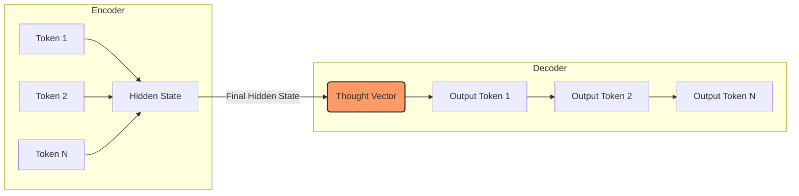

# Introduction to Prompt Engineering

Documentation regarding the evolution of Language Models (LMs), the architectures that define them, and the emergence of Prompt Engineering as a specialized discipline.

---

## 1. What is a Language Model?

!!! note "Definition"
    A **Language Model (LM)** is an AI system trained to understand and generate human language by predicting the **next token** (word, subword, or character) in a sequence based on statistical probability.

Modern language models are almost exclusively based on the **Transformer architecture**.

### The Core Mechanism
The fundamental lifecycle of a model involves:

1.  **Ingestion:** Reading massive text datasets (e.g., Common Crawl, Wikipedia, GitHub).
2.  **Tokenization:** Converting raw text into numerical "tokens."
3.  **Representation:** Learning complex statistical and semantic relationships between tokens.
4.  **Autoregressive Prediction:** Repeatedly predicting the most likely next token based on all preceding context.

??? info "Deep Dive: From Markov to iPhone"
    The language model technology familiar to many—the "guess-the-next-word" bar on mobile keyboards—is historically rooted in **Markov models**. First introduced by Claude Shannon in 1948, these models are "stateless," predicting the next word based solely on the current state. While efficient for simple tasks, they lack the "deep context" found in modern LLMs.

---

## 2. The Seq2Seq Era (Circa 2014)

By 2014, the most powerful models utilized the **Sequence-to-Sequence (seq2seq)** architecture, introduced by researchers at Google.

### Architecture: Recurrent Neural Networks (RNNs)
In theory, RNN-based seq2seq models were ideal for text because they process tokens sequentially, recurrently updating an **internal state**. This allowed for:

* Processing of arbitrarily long sequences.
* Specialized tasks: Classification, entity extraction, translation, and summarization.

### The Components
Seq2seq consists of two primary parts: the **Encoder** and the **Decoder**.



!!! danger "The Information Bottleneck"
    The **Thought Vector** (the final value of the hidden state) is fixed and finite. As a sequence grows longer, the encoder often "forgets" earlier parts of the text. This forces the entire meaning of a long sentence or paragraph into a single vector of limited size, creating a performance-limiting bottleneck.

#### The Seq2Seq Processing Lifecycle


1.  **Encoding:** Tokens from the source language are sent to the encoder one at a time, converted to an **embedding vector**, and used to update the internal state.
2.  **Packaging:** The final internal state is packaged as the **thought vector** and sent to the decoder.
3.  **Initialization:** A special "start" token is sent to the decoder, signaling the beginning of generation.
4.  **Decoding Loop:**
    * Conditioned on the thought vector, the decoder state is updated.
    * An output token from the target language is emitted.
    * The output token is fed back into the decoder as the next input.
    * The process loops until completion.
5.  **Termination:** The decoder emits an "end" token, signaling the process is finished.

## 3. The Attention & Transformer Revolution

To solve the information bottleneck, two major innovations occurred between 2015 and 2017.

### The Attention Mechanism (2015)
The paper *“Neural Machine Translation by Jointly Learning to Align and Translate”* introduced the concept of **Attention**.

* **The Innovation:** Instead of sending a single thought vector, the encoder preserves all hidden state vectors generated for every token.
* **The "Soft Search":** The decoder is allowed to "soft search" over all these vectors, essentially "paying attention" to different parts of the input sequence for each word it generates.

### The Transformer (2017)
Google’s *“Attention Is All You Need”* paper introduced the **Transformer**. While it retained the Encoder/Decoder structure, it removed all **recurrent circuitry**.

=== "Why it Matters"
    Transformers rely entirely on the Attention mechanism, making them significantly better at modeling data and much faster to train through parallelization.

=== "The Limitation"
    Unlike RNNs, which could theoretically process infinite text (despite forgetting), the Transformer can only process a **fixed, finite sequence** of inputs and outputs. This is known as the **Context Window**.


---

## 4. The Path to GPT

The **Generative Pre-trained Transformer (GPT)** architecture fundamentally changed how we use AI.

### GPT-1 (2018)
The paper *“Improving Language Understanding by Generative Pre-Training”* introduced a "decoder-only" architecture—essentially the Transformer with the encoder "ripped off."

#### The Pre-training/Fine-tuning Paradigm

At this stage, the standard workflow was:

1.  **Pre-train:** Train on massive, unlabeled data (web scrapes).
2.  **Architecture Mod:** Adjust the model structure for a specific task.
3.  **Fine-tune:** Apply specialized supervised training.

**Caveat:** A model fine-tuned for classification was *only* good at classification. It lacked generalizability.

### GPT-3 & Prompt Engineering (2020)
The 2020 paper *“Language Models Are Few-Shot Learners”* revealed a paradigm shift. Scaling the model size allowed it to perform tasks without task-specific architecture changes or fine-tuning.

??? tip "In-Context Learning (Few-Shot)"
    By providing a few examples of a task (**Few-Shot examples**) within the input, the model could faithfully reproduce the pattern. This discovery—that we could modify the input to condition the model's behavior—marked the official birth of **Prompt Engineering**.

---

## 5. Defining Prompt Engineering

At their most fundamental level, LLMs are **text completion engines**.

=== "Definition"
    **Prompt Engineering** is the practice of crafting and refining the **Prompt** (the input document or block of text) so that the model's **Completion** contains the precise information required to address the problem at hand.

=== "Key Strategies"
    * **Zero-Shot:** Providing instructions without examples.
    * **Few-Shot:** Providing examples to guide the pattern.
    * **Instruction Tuning:** Conditioning the model via direct imperatives (e.g., "Summarize this...").

=== "Modern Workflow"
    ```mermaid
    flowchart LR
        A[Problem Definition] --> B[Prompt Design]
        B --> C[LLM Execution]
        C --> D{Quality Check}
        D -- "Poor" --> B
        D -- "Optimal" --> E[Deployment]
    ```

---

## References & Seminal Papers

| Year | Paper                                                         | Contribution                                 |
| :--- | :------------------------------------------------------------ | :------------------------------------------- |
| 1948 | *A Mathematical Theory of Communication*                      | Introduction of Markov models                |
| 2014 | *Sequence to Sequence Learning with Neural Networks*          | Introduction of seq2seq (Google)             |
| 2015 | *Neural Machine Translation by Jointly Learning...*           | Introduction of the Attention mechanism      |
| 2017 | *Attention Is All You Need*                                   | Introduction of the Transformer architecture |
| 2018 | *Improving Language Understanding by Generative Pre-Training* | GPT-1 (Pre-training + Fine-tuning)           |
| 2020 | *Language Models Are Few-Shot Learners*                       | GPT-3 (In-context learning / Few-shot)       |
