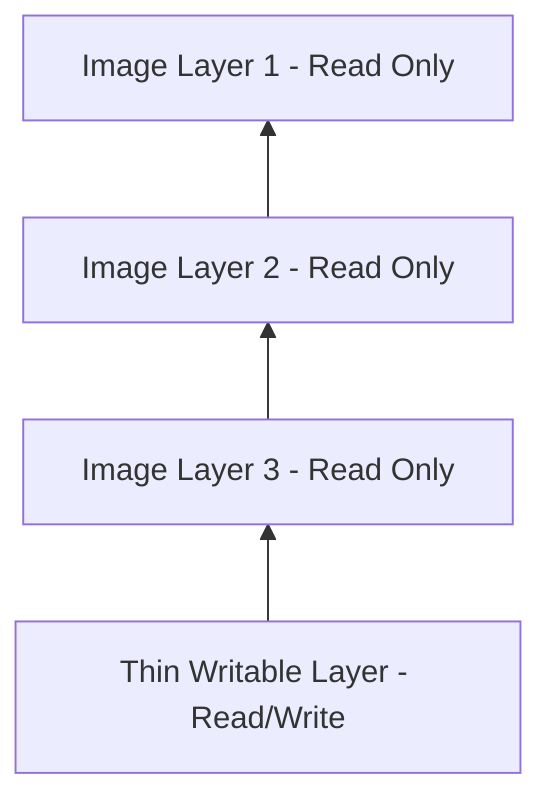

# 🐳 Working with Containers

Containers are the fundamental building blocks of modern cloud-native applications. This guide explores their architecture, lifecycle, and operational management, with a specific focus on concepts relevant to the **CKAD (Certified Kubernetes Application Developer)** curriculum.

---

## 1. The OCI Foundation

Docker and other modern container engines implement the **Open Container Initiative (OCI)** specifications. The OCI defines industry standards for:

1.  **Image Specification:** Defines the format of the container image.
2.  **Runtime Specification:** Defines how to run a container (handled by low-level runtimes like `runc`).


---

## 2. Containers: The TLDR

At a high level, a container is a **run-time instance of an image**.

* **Relationship:** You can instantiate multiple containers from a single read-only image.
* **State:** Containers are designed to be **stateless**, **ephemeral**, and **immutable**.
* **Immutability Principle:** Do not "patch" a running container. If it fails or needs an update, destroy it and replace it with a new instance from a new image.
* **Process Isolation:** A container should ideally run a **single process** (PID 1). This is the cornerstone of the microservices architectural pattern.

---

## 3. Containers vs. Virtual Machines

The fundamental difference lies in the **level of abstraction**.

=== "Architecture Comparison"

    ```mermaid
    graph TD
        subgraph VM_Model [Virtual Machine Model]
            H1[Physical Hardware] --> HV[Hypervisor]
            HV --> VM1[VM 1: Guest OS + App]
            HV --> VM2[VM 2: Guest OS + App]
        end

        subgraph Container_Model [Container Model]
            H2[Physical Hardware] --> OS[Host Operating System]
            OS --> CR[Container Runtime / Docker]
            CR --> C1[Container 1: App]
            CR --> C2[Container 2: App]
        end
    ```

=== "Key Differences"

    | Feature         | Virtual Machines (VMs)     | Containers                           |
    | :-------------- | :------------------------- | :----------------------------------- |
    | **Abstraction** | Virtualizes **Hardware**   | Virtualizes the **Operating System** |
    | **Kernel**      | Each VM has its own Kernel | All containers share the Host Kernel |
    | **Isolation**   | Strong (Hardware-level)    | Process-level (Namespaces/Cgroups)   |
    | **Boot Time**   | Minutes                    | Milliseconds / Seconds               |
    | **Efficiency**  | Heavy (The "VM Tax")       | Lightweight                          |

### The "VM Tax"
One of the primary drivers for container adoption is eliminating the overhead of the Guest OS. In a VM, every instance requires its own full OS, which consumes significant CPU, RAM, and storage before the application even starts. Containers bypass this by sharing the host's resources via the container engine.

!!! note "Security and Hardening"
    While VMs offer strong hardware isolation, most container engines implement sensible defaults for security technologies such as **SELinux**, **AppArmor**, **seccomp**, and **Linux Capabilities**. Properly configured, containers can be hardened to provide security levels comparable to VMs.

---

## 4. Image/Container Storage Mechanics

Docker uses a **Layered Filesystem** approach to manage images and containers efficiently.




* **Read-Only Layers:** The image itself is composed of static, immutable layers.
* **The Thin Writable Layer:** When a container starts, Docker places a thin "Read-Write" layer on top of the shared image.
* **Persistence:** * Changes made by the container (file edits, new data) are stored in this R/W layer. 
    * **Stopping** a container preserves the R/W layer.
    * **Deleting** a container permanently destroys the R/W layer.

---

## 5. Accessing the Docker Engine

!!! info "Unix Socket Permissions"
    On Linux, the Docker API is exposed via a privileged local Unix socket at `/var/run/docker.sock`. To access it without `sudo`, you must add your user to the `docker` group:
    
    ````bash
    sudo usermod -aG docker <username>
    # Note: You must restart your shell or log out/in for changes to take effect.
    ````

---

## 6. How Containers Start Applications

There are three ways to define how a containerized application starts. Understanding the precedence is critical for CKAD.

### Precedence and Logic
1.  **Entrypoint:** The command that *always* runs.
2.  **CMD:** The default arguments passed to the Entrypoint.
3.  **CLI Arguments:** Passed during `docker run`.

| Instruction    | Overrideable? | Behavior                                           |
| :------------- | :------------ | :------------------------------------------------- |
| **ENTRYPOINT** | No (mostly)   | Becomes the main process. CLI args are *appended*. |
| **CMD**        | Yes           | Replaced entirely if CLI arguments are provided.   |

### Inspecting Metadata
You can find these instructions using `docker inspect`:

```bash
docker inspect <image_name> | grep Entrypoint -A 3
```


### The docker run Syntax

The format of the command dictates how overrides occur:

```
docker run <arguments> <image> <command>
```

If a `<command>` is provided, it overrides the CMD instruction but is appended as an argument to an ENTRYPOINT.

## 7. Connecting to and Inspecting Containers


### `docker exec Modes`

The exec command allows you to run processes inside an existing container. This is primarily used for debugging.

=== "Interactive Mode"
Connects your terminal to a shell process (like SSH).

```
bash docker exec -it <container_id_or_name> sh 
```

=== "Remote Execution"
Sends a single command, prints output, and exits.

```
bash docker exec <container_id_or_name> ps 
```

## 8. Process Management: The PID 1 Rule

In a container, the main application process is always PID 1.

!!! danger "The Lifecycle of PID 1"
    A container only lives as long as its PID 1 process. If the main process exits, crashes, or is killed, the container terminates immediately.

### Inspecting Processes

If you are inside an interactive session, you can see the process tree:


```
/app $ ps
PID   USER     TIME  COMMAND
    1 1000     29:09 {mkdocs} /usr/local/bin/python3.11 /usr/local/bin/mkdocs serve
1113900 1000      0:00 sh
1113906 1000      0:00 ps
```

- PID 1: The main app (e.g., MkDocs).
- High PIDs: Your exec session shell and the ps command itself.

## 9. Lifecycle Management

| Action  | Command          | Effect                                                       |
| ------- | ---------------- | ------------------------------------------------------------ |
| Start   | `docker run`     | Creates a new container and starts it                        |
| Restart | `docker restart` | Restarts the container; PID 1 is killed and a new one starts |
| Stop    | `docker stop`    | Gracefully shuts down the container                          |
| Inspect | `docker inspect` | Returns detailed JSON metadata about the container state     |


!!! tip "Persistence Note"
    Stopping or restarting a container does not lose data in the writable layer. Only a docker rm (removal) deletes that data.