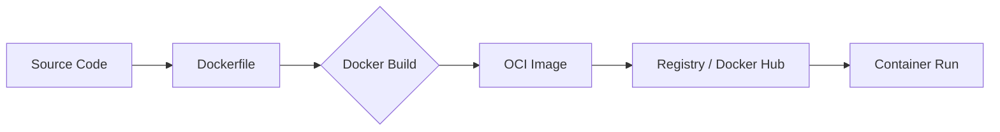

# Containerizing an Application


This guide covers the end-to-end process of transforming source code into a portable, secure, and production-ready container image. It is specifically designed to align with **CKAD (Certified Kubernetes Application Developer)** competencies.

---

## 1. Overview: The Containerization Lifecycle

Docker simplifies the lifecycle of an application through a standardized process often referred to as "build, share, run."



### The "TLDR" Process

1.  **Develop:** Write your application and define its dependency list (e.g., `requirements.txt`, `package.json`).
2.  **Define:** Create a `Dockerfile` containing instructions for the build engine.
3.  **Build:** Compile the application and its environment into an **Immutable Image**.
4.  **Distribute:** Push the image to an OCI-compliant registry (optional but standard).
5.  **Execute:** Start a container instance from the image.

---

## 2. Bootstrapping with `docker init`

Modern Docker versions (Desktop 4.27.0+) provide a powerful utility to jumpstart containerization while following industry best practices.

### Using the Init CLI
The `docker init` command analyzes your build context and generates necessary templates automatically.

```bash
$ docker init
```

!!! example "Interactive Walkthrough"

    1.  **Platform:** Select your language (e.g., Node, Python, Go).
    2.  **Version:** Choose the specific runtime version (e.g., Node 23.3.0).
    3.  **Package Manager:** (e.g., npm, pip, go mod).
    4.  **Entrypoint:** Define the start command (e.g., `node app.js`).
    5.  **Port:** Define the listener (e.g., 8080).

**Resulting Artifacts:**

* `Dockerfile`: Optimized for the chosen language.
* `.dockerignore`: Prevents sensitive or heavy files (like `node_modules` or `.git`) from entering the build context.
* `compose.yaml`: Ready-to-use local orchestration.
* `README.Docker.md`: Documentation for the generated files.

---

## 3. Anatomy of a Production-Ready Dockerfile

A well-crafted `Dockerfile` is efficient, secure, and utilizes layer caching. Below is an annotated example of an MkDocs (Python) application.

```dockerfile
# 1. Define global arguments
ARG PYTHON_VERSION=3.11
# Use a lightweight Python alpine image as the base
FROM python:${PYTHON_VERSION}-alpine

# 2. Environment Configuration
# Disable MkDocs 2.0 warnings for future-proofing
ENV NO_MKDOCS_2_WARNING=1
# Prevent Python from writing .pyc files
ENV PYTHONDONTWRITEBYTECODE=1
# Ensure logs are emitted immediately (unbuffered)
ENV PYTHONUNBUFFERED=1

# 3. Install System Dependencies
# --no-cache keeps the image small by skipping index storage
RUN apk add --no-cache \
    cairo \
    pango \
    gdk-pixbuf \
    libffi \
    git

# 4. Security: Implement Non-Privileged User
# CKAD Note: Always avoid running containers as root in production.
ARG UID=10001
RUN adduser \
    --disabled-password \
    --gecos "" \
    --home "/nonexistent" \
    --shell "/sbin/nologin" \
    --no-create-home \
    --uid "${UID}" \
    appuser

# 5. Build Logic
WORKDIR /app
COPY requirements.txt .

# Leverage BuildKit cache mounts and bind mounts for high performance
RUN --mount=type=cache,target=/root/.cache/pip \
    --mount=type=bind,source=requirements.txt,target=requirements.txt \
    pip install -r requirements.txt

# 6. Runtime Configuration
USER appuser
EXPOSE 8000
CMD ["mkdocs", "serve", "--dev-addr=0.0.0.0:8000"]
```

### Instruction Breakdown

| Line Group | Instruction | Purpose |
| :--- | :--- | :--- |
| **1** | `FROM` | Defines the base image. Pulls from Docker Hub if not local. |
| **2** | `ENV` | Sets persistent environment variables within the image. |
| **3** | `RUN apk` | Executes shell commands to install OS-level dependencies. |
| **4** | `WORKDIR` | Sets the context for all subsequent `RUN`, `CMD`, and `COPY` steps. |
| **5** | `COPY` | Transfers files from the local **Build Context** to the image filesystem. |
| **6** | `RUN pip` | Installs application-level dependencies. |
| **7** | `EXPOSE` | **Documentation only:** Informs users which port the app intends to use. |
| **8** | `CMD` | Defines the default command to execute when the container starts. |

---

## 4. Executing the Build

### Standard Build Command
Use the `-t` flag to "tag" your image with a human-readable name.

```bash
docker build -t study-saathi-mkdocs:latest .
```

??? info "Deep Dive: The Build Output & Layering"
    When you build an image, BuildKit parses the file line-by-line.

    * **Layer Count:** You may notice more layers in `RootFS` than instructions in your Dockerfile. For example, a 6-line Dockerfile might result in 9 layers. This happens because the **Base Image** (e.g., `python:alpine`) already contains its own set of layers.
    * **CACHED:** If an instruction hasn't changed since the last build, Docker uses the local cache to skip the step.
    * **Exporting:** The final stage creates an **Image Manifest** (JSON) and an **Image Config** that describes the stack.

---

## 5. Image Distribution and Registries

### Pushing to Docker Hub
To share an image, it must follow a specific naming convention: `DockerID/Repository:Tag`.

=== "Step 1: Tagging"
    If you built an image as `ddd-book:latest`, you must re-tag it with your username.
    ```bash
    docker tag ddd-book:latest nigelpoulton/ddd-book:ch8.node
    ```

=== "Step 2: Pushing"
    Ensure you are logged in via `docker login`.
    ```bash
    docker push nigelpoulton/ddd-book:ch8.node
    ```

=== "Step 3: External Registries"
    To use a different registry (like GitHub Container Registry), prefix the tag with the DNS name.
    ```bash
    docker pull ghcr.io/regclient/regsync:latest
    ```

---

## 6. Multi-Stage Builds (Production Optimization)

Multi-stage builds allow you to use a "Heavy" image for building (with compilers) and a "Slim" image for the final production environment.

!!! tip "CKAD Tip: Minimal Images"
    Production images should only contain runtime artifacts. This reduces the **Attack Surface** and bandwidth usage.

```dockerfile
# Stage 0: Base build tools
FROM golang:1.23.4-alpine AS base
WORKDIR /src
COPY go.mod go.sum .
RUN go mod download
COPY . .

# Stage 1: Build Client (Parallelizable)
FROM base AS build-client
RUN go build -o /bin/client ./cmd/client

# Stage 2: Build Server (Parallelizable)
FROM base AS build-server
RUN go build -o /bin/server ./cmd/server

# Stage 3: Final Production Image
FROM scratch AS prod
COPY --from=build-client /bin/client /bin/
COPY --from=build-server /bin/server /bin/
ENTRYPOINT [ "/bin/server" ]
```

### Stages vs. Parallelism
* **Sequential:** The builder runs `base` first.
* **Parallel:** `build-client` and `build-server` can run simultaneously because they both depend on `base` but not on each other.
* **Scratch:** Using `FROM scratch` creates a zero-byte base, the smallest possible starting point for statically compiled binaries.

### Targeting Specific Stages
You can stop the build at a specific stage using `--target`:

```bash
docker build -t multi:client --target prod-client -f Dockerfile .
```

this can be used build multiple images from a single Dockerfile.

---

## 7. Advanced Build Engine: Buildx & BuildKit

### Architecture
* **Client (Buildx):** CLI plugin supporting advanced features.
* **Server (BuildKit):** The execution engine.

### Builders and Drivers
You can create isolated BuildKit instances (Builders) using different drivers.

| Driver | Environment | Performance |
| :--- | :--- | :--- |
| **docker** | Default daemon | Standard. |
| **docker-container** | Dedicated container | Supports Multi-Arch via QEMU emulation. |
| **remote** | External server | Highest performance, offloads CPU/RAM from dev machine. |
| **Build Cloud** | Docker Managed | Native hardware speeds, shared team cache. |

---

## 8. Multi-Architecture Builds

To support both Intel (`amd64`) and Apple Silicon/Graviton (`arm64`), use the `--platform` flag.

```bash
# 1. Create a builder that supports multi-arch
docker buildx create --driver=docker-container --name=container --use

# 2. Build for multiple platforms
docker buildx build \
  --platform=linux/amd64,linux/arm64 \
  -t nigelpoulton/ddd-book:ch8.1 --push .
```

!!! note "Emulation Note"
    The `docker-container` driver uses **QEMU** to emulate target hardware. While highly compatible, it is significantly slower than native builds or Docker Build Cloud.

---

## 9. Security: Vulnerability Scanning with Docker Scout

Scanning should be an integrated part of your build pipeline.

### Quickview and CVE Analysis
Use `docker scout` to analyze an image for known vulnerabilities before deployment.

```bash
# Get a summary
docker scout quickview <IMAGE_ID>

# Get detailed CVE info and remediation advice
docker scout cves <IMAGE_ID>
```

---

## 10. Build Best Practices

### I. Leverage the Build Cache
* **Order Matters:** Instructions that change frequently (like `COPY . .`) should go at the end.
* **Cache Invalidation:** If one line results in a "cache miss," all subsequent lines are re-executed.
* **Checksums:** For `COPY` and `ADD`, Docker performs a checksum on the content. If a single bit in `requirements.txt` changes, the cache is invalidated for that step.

### II. Minimal Package Installation

Avoid installing recommended or suggested packages that aren't strictly necessary.

```dockerfile
# Example: Debian/Ubuntu
RUN apt-get update && apt-get install -y --no-install-recommends \
    curl \
    && rm -rf /var/lib/apt/lists/*
```

### III. Managing Images

* **Remove Image:** `docker rmi <ID>` (Removes the image and all unshared layer data).
* **Force Remove:** `docker rmi -f` (Use with caution; this untags images in use, leaving "dangling" images).
* **Bulk Cleanup:**
    ```bash
    # Deletes all local images
    docker rmi $(docker images -q) -f
    ```