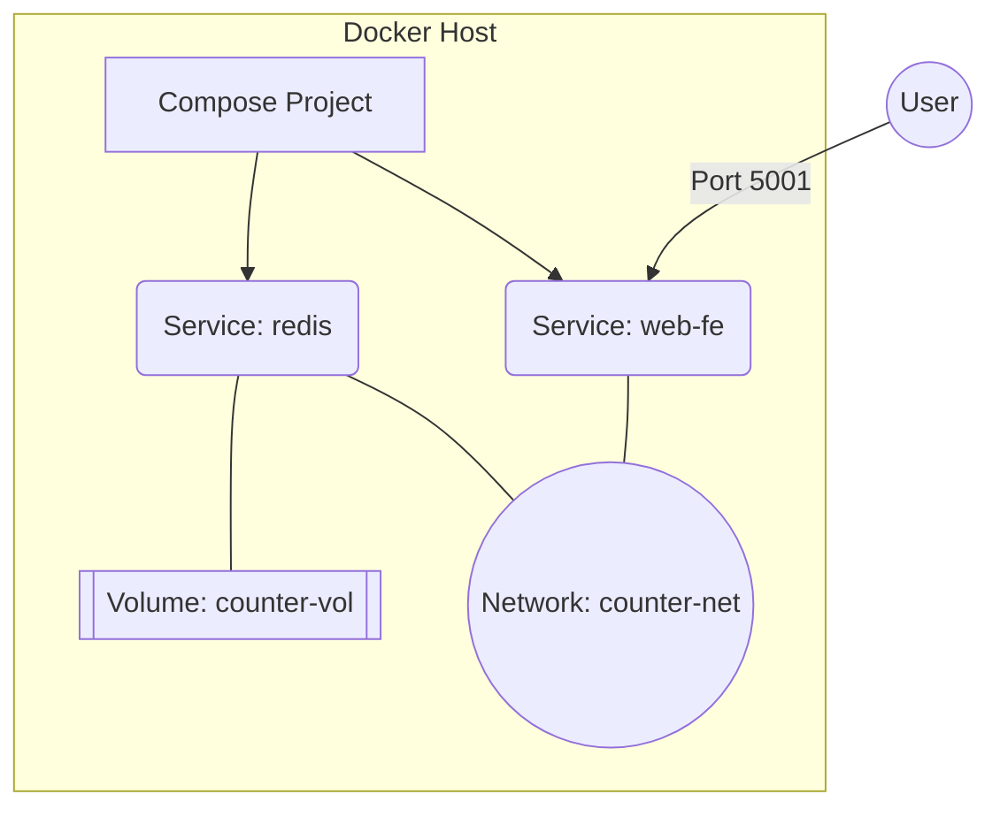

# Multi-Container Orchestration with Docker Compose

Docker Compose is a tool for defining and running multi-container applications. Instead of managing individual containers via complex CLI commands, Compose allows you to use a **declarative YAML file** to manage your entire application stack as a single unit.

---

## 1. Concepts and Evolution

### The Journey from Fig to Compose

Originally, a tool called **Fig** (developed by Orchard Labs) revolutionized Docker by allowing users to define multi-container microservices in a simple YAML file. Docker, Inc. acquired Orchard Labs and rebranded Fig as **Docker Compose**.

Today, Compose is driven by the **Compose Specification**, an open community-led standard. While Docker Compose is the reference implementation, the specification ensures consistent governance across different platforms.

### Why Use Compose?

While primarily used for development, testing, and CI/CD environments, Compose introduces concepts that are foundational for the **CKAD (Certified Kubernetes Application Developer)** exam:

* **Self-healing & Scaling:** Provides a simplified view of how microservices benefit from these patterns.
* **Service Discovery:** Allowing containers to communicate via service names rather than IP addresses.
* **Declarative Configuration:** Defining the "desired state" of your infrastructure in code.
* **Resource Isolation:** Automatic creation of dedicated networks and volumes.

---

## 2. Architecture of a Compose App

When you deploy an application, Docker Compose parses your YAML file and orchestrates the creation of several objects: Services, Networks, and Volumes .etc


### Resource Naming Conventions

Docker assigns a **Project Name** based on the directory name of your build context. It then names resources using the pattern: `[project-name]-[service-name]-[index]`.

| Resource Type | Internal Name Example         |
| :------------ | :---------------------------- |
| **Service**   | `multi-container-web-fe-1`    |
| **Network**   | `multi-container_counter-net` |
| **Volume**    | `multi-container_counter-vol` |


It names resources using a predictable pattern to avoid conflicts.


---

## 3. The Compose File (`compose.yaml`)

Compose looks for a file named `compose.yaml` or `compose.yml` by default. 

!!! tip "Standard Filenames"
    Modern Docker standards prefer `compose.yaml`. If you use a custom name like `prod.yaml`, you must specify it using the `-f` flag:
    `docker compose -f prod.yaml up`.

### Sample Application Configuration

The following example defines a web frontend and a Redis backend.

```yaml
services:
  web-fe:
    deploy:
      replicas: 1
    build: .
    command: python app.py
    ports:
      - target: 8080
        published: 5001
    networks:
      - counter-net
      
  redis:
    deploy:
      replicas: 1
    image: "redis:alpine"
    networks:
      - counter-net
    volumes:
      - type: volume
        source: counter-vol
        target: /data

networks:
  counter-net:

volumes:
  counter-vol:
```



### Key Directives Explained

* `services`: The mandatory top-level key defining the application components.
* `build: .`: Directs Docker to build an image from the Dockerfile in the current directory.
* `image`: Specifies an existing image to pull (e.g., from Docker Hub).
* `ports`: Maps the container port (target) to the host port (published).
* `command`: The execution instruction.
* `networks`: Connects containers to a shared network. This enables Service Discovery, allowing web-fe to reach redis simply by using the hostname redis.
* `volumes`: Mounts a persistent volume. This ensures data is not lost if the container is stopped or deleted.
* `deploy.replicas` : Defines the number of containers. 

!!! info ""
    On Docker Desktop, you can usually only run **1 replica** for services that bind to a specific host port (e.g., 5001), as multiple containers cannot bind to the same host port simultaneously.

## 4. Operational Lifecycle

Deployment and Management

=== "Deploying"
    The up command is the primary way to deploy. It builds images, creates networks/volumes, and starts containers.

    ```bash
        # Start in the background (detached mode) 
        docker compose up -d 
    ```

=== "Monitoring"

    Check the health and processes of your multi-container stack.

    ```bash
    # List container status, ports, and state
    docker compose ps
    # List processes running inside each container (Host PIDs)
    docker compose top
    ```

    !!! warning "Process IDs (PID)"
        The PID numbers returned by `docker compose top` are the PIDs as seen from the **Docker Host**, not from within the container's isolated namespace.


=== "Stopping & Restarting"

    Stop the app without deleting resources, or perform a restart.

    ```bash
    # Stop containers (preserves container state)
    docker compose stop
    # Restart stopped containers
    docker compose restart
    ```


    !!! warning "Restart Limitation"
        docker compose restart does not pick up changes made to the compose.yaml file. To apply configuration changes, you must run docker compose up again (which performs a recreation of affected services).

## 5. Teardown and Cleanup

=== "Standard Down"
    Stops and removes containers and networks.

    ```bash
    docker compose down 
    ```

    !!! info "Persistence of Volumes"
        By default, docker compose down does not delete volumes. This is a safety feature to prevent accidental data loss. You must explicitly use the `--volumes` (or `-v`) flag to remove them.

=== "Full Purge"
    Removes volumes and images along with containers. Use this to ensure a completely clean slate.

    ```bash
    docker compose down --volumes --rmi all 
    ```


## 6. CKAD Bridge: From Compose to Kubernetes

For those transitioning to Kubernetes, use the following mental model to map Compose concepts to K8s objects:

| Docker Compose | Kubernetes Equivalent                                     |
| -------------- | --------------------------------------------------------- |
| `service`      | `Deployment` (controls Pods/Replicas)                     |
| `network`      | `Service` (DNS/ClusterIP)                                 |
| `volume`       | `PersistentVolumeClaim (PVC)`                             |
| `image`        | Container image inside a `Pod`                            |
| `compose.yaml` | Kubernetes manifests (multiple YAML files or Helm Charts) |

## 7. Command Summary Reference

| Command                  | Description                                                  |
| ------------------------ | ------------------------------------------------------------ |
| `docker compose up -d`   | Deploy the application stack in detached mode                |
| `docker compose ps`      | View the status of containers in the current Compose project |
| `docker compose top`     | View host-level process IDs for each service                 |
| `docker compose logs -f` | Tail and follow logs for all services in the stack           |
| `docker compose stop`    | Stop services without removing containers or networks        |
| `docker compose down`    | Stop and remove containers, networks, and related resources  |
| `docker compose ls`      | List all running Docker Compose projects on the host         |