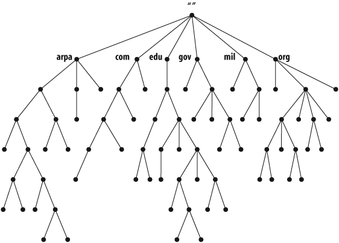
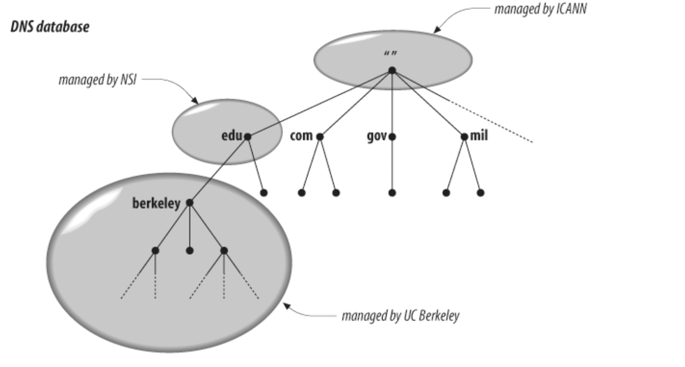
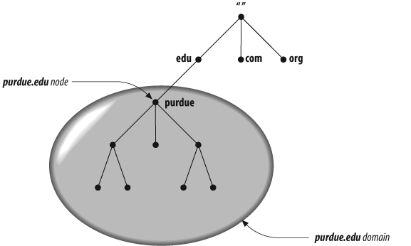
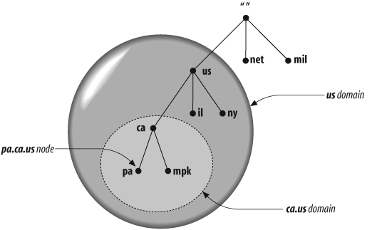
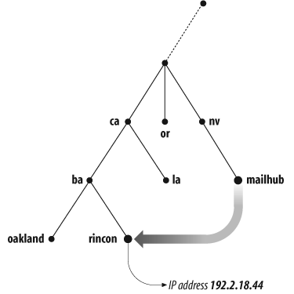

# DNS

> A fun [comic](https://howdns.works/ep1/) explainign DNS

## The History of the Domain Name System

During the 1970s, the ARPAnet was a relatively small and cooperative network consisting of only a few hundred hosts. At that time, a single file called **HOSTS.TXT** maintained the mapping between hostnames and their corresponding IP addresses. On Unix systems, this data was incorporated into the local host table (`/etc/hosts`).

Whenever administrators needed to update host information, they would email their changes to the Network Information Center (NIC). Periodically, they would retrieve the updated **HOSTS.TXT** file from SRI-NIC via FTP. These updates were consolidated into a new version of the file once or twice a week.

However, as ARPAnet expanded, this centralized approach became inefficient and difficult to manage. The size of **HOSTS.TXT** grew rapidly with the number of hosts, making updates slower, error-prone, and increasingly unscalable.

---

## Domain Name System (DNS)

The **Domain Name System (DNS)** was introduced to address these scalability issues by providing a **distributed database** for name resolution.

DNS operates on a client-server model:

* **Nameservers** act as servers, storing information about specific portions of the DNS database.
* **Resolvers** act as clients, querying nameservers to retrieve this information.

---

## The Domain Namespace

The DNS database is organized as a hierarchical structure resembling an **inverted tree**, with the **root node** at the top. 

!!! note ""
    Each node in the tree has a text label (without dots) that can be up to 63 characters long. A null (zero-length) label is reserved for the root. When the root node’s label appears by itself, it is written as a single dot, “.”, for convenience.

DNS’s distributed database is indexed by domain names. Each domain name is essentially just a path in a large inverted tree, called the domain namespace.

DNS’s tree can branch any number of ways at each intersection point, or node. The depth of the tree is limited to 127 levels 

Each domain in this hierarchy can be further divided into smaller units called **subdomains**. The responsibility for managing these subdomains can be delegated to different organizations, enabling a distributed and scalable administrative model.

For example, delegating authority for **berkeley.edu** to the University of California, Berkeley creates a new administrative unit known as a **zone**. This zone becomes an independently managed portion of the namespace and includes all domain names ending in *berkeley.edu*. Meanwhile, the **edu** domain retains authority only over names that are not part of delegated subdomains.

---

## Domain Names and Their Role

The full domain name of any node in the tree is the sequence of labels on the path from that node to the root. Domain names are always read from the node toward the root (“up” the tree), with dots separating the names in the path.

!!! note ""
    Some software interprets a trailing dot in a domain name to indicate that the domain name is absolute. An absolute domain name is written relative to the root and unambiguously specifies a node’s location in the hierarchy. An absolute domain name is also referred to as a fully qualified domain name, often abbreviated FQDN. Names without trailing dots are sometimes interpreted as relative to some domain name other than the root

DNS requires that sibling nodes—nodes that are children of the same parent—have different labels. This restriction guarantees that a domain name uniquely identifies a single node in the tree.

Domain names serve as **indexes into the DNS database**, with various types of data associated with them. Conceptually, this data is "attached" to domain names.

### Domains

A domain is simply a subtree of the domain namespace. The domain name of a domain is the same as the domain name of the node at the very top of the domain.

A domain encompasses all hosts and subdomains within its portion of the hierarchy—that is, everything contained within its subtree. Any domain name in the subtree is considered a part of the domain.

!!! note ""
    Because a domain name can be in many subtrees, a domain name can also be in many domains.
    

A domain may have several subtrees of its own, called subdomains. A subdomain’s domain name ends with the domain name of its parent domain.

Domains are often referred to by level.

- A top-level domain is a child of the root.
- A first-level domain is a child of the root (a top-level domain).
- A second-level domain is a child of a first-level domain, and so on.

---

## Hosts and Aliases

Every host on a network is assigned a **domain name**, which maps to information about that host. This information may include:

* IP addresses
* Mail routing details
* Other service-related data

Additionally, a host may have one or more **aliases**. These aliases are alternative domain names that point to the host’s primary (canonical) domain name.

----

## References
- [DNS and BIND, 5th Edition # 2. How Does DNS Work?](https://learning.oreilly.com/library/view/dns-and-bind/0596100574/ch02.html#dns5-CHP-2-SECT-1.2)
