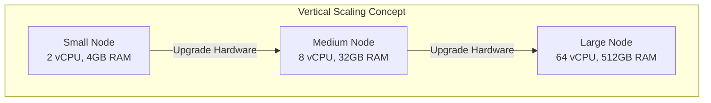

# Vertical vs Horizontal Scaling

| Characteristic            | Scale Up (Vertical)                                                | Scale Out (Horizontal)                                                  |
| ------------------------- | ------------------------------------------------------------------ | ----------------------------------------------------------------------- |
| Definition                | Adding more resources to existing nodes                            | Adding more nodes to the system                                         |
| Best for                  | Memory-intensive workloads, monolithic applications, certain RDBMS | Web servers, distributed systems, microservices, stateless applications |
| Cost model                | Higher upfront costs, premium hardware                             | Gradual investment, commodity hardware                                  |
| Implementation complexity | Simpler implementation                                             | More complex networking and orchestration                               |
| Scalability ceiling       | Limited by single server capabilities                              | Theoretically unlimited                                                 |
| Resilience                | Single point of failure risk                                       | Better fault tolerance the redundancy is built-in.                      |
| Data Consistency          | Simple; local data consistency.                                    | Complex; requires distributed consensus or eventual consistency.        |
| Kubernetes support        | Supports resource requests/limits adjustment, VPA                  | Native HPA, cluster autoscaling                                         |

## Vertical Scaling

Vertical scaling, referred to as “scale up”, means the process of adding more power (CPU, RAM, etc.) to your servers. This approach applies to traditional applications deployed on physical servers or virtual machines as well as containerized applications.

### Advantages of Scaling Up

- It is simple and straightforward. For applications with a more traditional and monolithic architecture, it is much simpler to just add more computing resources to scale.
- Take advantage of powerful server hardware
- In the initial phase, vertical scaling may be more cost-effective than horizontal scaling, especially when dealing with moderate increases in demand.
- Simplest for stateful applications. You don't have to worry about synchronizing state across different machines.

No Major Code Changes: Often requires little to no adjustments to your application's codebase.

### Disadvantages of Scaling Up

- Scaling up has limits will hit the physical hardware limitations sooner or later.
- As you add compute resources to a physical server, it is difficult to increase and balance the performance linearly for all the components, and you will most likely hit a bottleneck somewhere.
- the larger servers with high computing power cost more.
- Upgrading hardware often requires taking the server offline, which can be a significant disadvantage.
- With all resources on one server, any hardware failure can bring down the entire system.

### Performance Considerations

Scale up solutions add more resources to a single system, which can provide faster processing for applications that benefit from shared memory access. For e.g Many traditional database systems perform better with vertical scaling because they can leverage larger memory pools without network latency.

### Flexibility and Agility

Upgrading a vertically scaled system often requires downtime and has physical limits that eventually necessitate a platform change.

!!! danger "The SPOF Risk"
    Vertical scaling creates a Single Point of Failure. If the motherboard, CPU, or power supply of that one server fails, your entire system is offline until hardware is replaced or failed over.

## Horizontal Scaling

With horizontal scaling, the compute resource limitations from physical hardware are no longer a challenge. This approach works particularly well for software as a service applications with distributed architecture.

### Advantages of Scaling Out

- It delivers long-term scalability.
- Scaling back is easy.
- Can utilize commodity server
- The failure of one node does not bring down the entire system, minimizing downtime.

### Disadvantages of Scaling Out

- Might need to re-architect your application if your application is using monolithic architecture(s).
- The complexity of networking between components grows, requiring robust service discovery, communication protocols, data consistency, load balancing, and inter-server communication..
- With distributed systems, ensuring data consistency across multiple nodes requires careful design.
- Communication between servers can introduce additional latency compared to a single machine.
- To scale horizontally effectively, your application servers should be Stateless. Any session data should be stored in a centralized store (like Redis) so any server in the pool can handle any request.

### Performance Considerations

Scale out solutions distribute workloads across multiple systems, which is ideal for applications that can process data in parallel. Web servers and stateless applications typically perform better with horizontal scaling because they can handle more concurrent requests.

> scale out systems often introduce network overhead that can impact latency-sensitive operations.

### Flexibility and Agility
Scale out architectures offer better adaptability for unpredictable workloads. They can expand during peak demand periods and contract during quiet periods like low traffic windows, optimizing resource usage. This makes horizontal scaling particularly suited for applications with variable usage patterns.

!!! tip "Commodity Hardware"
    Horizontal scaling allows you to use "Commodity Hardware"—standard, inexpensive servers. It is often much cheaper to run ten $100/mo servers than one $2,000/mo server with the same aggregate power.

## Diagonal Scaling

A combination of vertical and horizontal scaling can be used to optimize system performance and cost-effectiveness. 

Diagonal scaling is a versatile and adaptive approach to managing system resources. It’s particularly effective in environments where the quantity of requests and the complexity or resource demands of these requests are increasing. By combining the principles of horizontal and vertical scaling, diagonal scaling provides a comprehensive solution to enhance system performance and capacity.

### Advantages Diagonal Scaling

- Diagonal scaling combines the adaptability of horizontal scaling with the enhanced power of vertical scaling.
- It allows for balanced resource utilization across more powerful nodes.

### Disadvantages Diagonal Scaling

- Diagonal scaling introduces greater complexity along with potentially higher initial costs.

## When to Use Horizontal vs Vertical Scaling vs Diagonal Scaling

Things to consider to decide between vertical and horizontal scaling:

- Analyze initial hardware costs vs. long-term operational expenses.
- Is your application CPU bound, memory bound, or does it lend itself to distribution?
- Can your application code handle distributed workloads?
- How much scaling do you realistically anticipate?

Choosing the right strategy depends on your specific application constraints and growth projections.

=== "Application Type"
  * Monolith: Start with Vertical Scaling. Refactoring a monolith for horizontal scaling often requires a transition to Microservices.
  * Microservices: Use Horizontal Scaling. These are designed to be distributed by nature.
  * Stateless Web App: Use Horizontal Scaling. This is the most efficient path for web traffic.

=== "Data Consistency"
  * Strict Consistency (ACID): Traditional RDBMS (SQL) usually scale Vertically. Scaling them horizontally requires complex sharding or specialized distributed SQL (e.g., CockroachDB).
  * Eventual Consistency: NoSQL databases (Cassandra, MongoDB) are built for Horizontal Scaling out of the box.

=== "Throughput vs. Latency"
  * Throughput (QPS): If you need to handle more total requests per second, Horizontal Scaling is superior.
  * Latency: If a single request takes too long to process (CPU bound), Vertical Scaling may provide faster processing via raw clock speed.

## Reference

- [Scale Up vs Scale Out: What is the Difference?](https://portworx.com/blog/scale-up-vs-scale-out/)
- [System Design: Vertical vs Horizontal Scaling](https://blog.algomaster.io/p/system-design-vertical-vs-horizontal-scaling)
- [Scaling Software Systems: 10 Key Factors](https://www.codereliant.io/p/scaling-software-systems-10-key-factors)