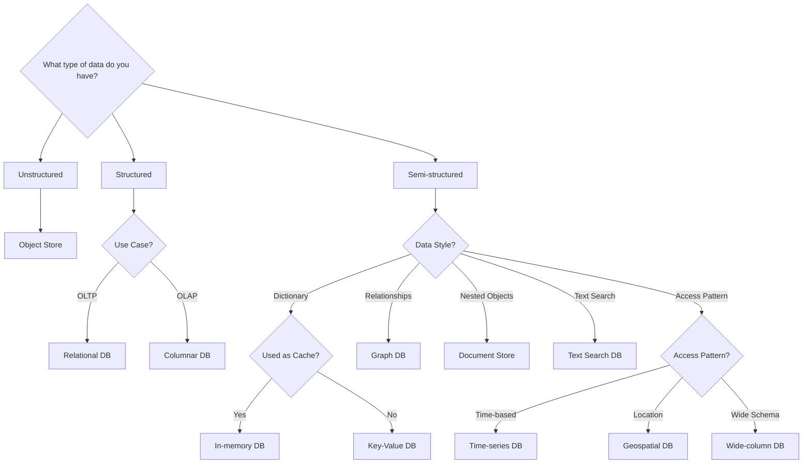

# Database Selection Strategy

The selection of an appropriate database is a critical architectural decision that directly impacts a system's scalability, performance, and maintainability. This choice depends on various factors, including the structure of the data, concurrency requirements, and expected query patterns.

---

## Structured Data: Relational & Analytical

### Relational Databases (RDBMS / SQL)

Relational Database Management Systems (RDBMS) or **SQL databases** represent data in a structured format using tables with predefined schemas.

#### Core Characteristics

* **ACID Compliance:** Relational databases prioritize **Atomicity, Consistency, Isolation, and Durability**, making them essential for enterprise data where transaction integrity is non-negotiable.
* **Structured Query Language (SQL):** Standardized language for complex querying and data manipulation.
* **Joins:** Superior support for multi-table join operations to derive complex relationships.

#### Popular Options

* **PostgreSQL:** Highly extensible and known for advanced feature support (e.g., JSONB, GIS).
* **MySQL:** Widely used, particularly for web applications, known for speed and reliability.

!!! info "When to Choose SQL"
    Choose an RDBMS when your data schema is stable, you require strict data integrity (financial systems), and your queries involve complex relationships across multiple entities.

### Columnar Databases (Analytical)

Optimized for **OLAP (Online Analytical Processing)**. Instead of storing data in rows, it stores data in columns to accelerate aggregate queries (SUM, AVG) over billions of rows.

* **Examples:** Snowflake, ClickHouse, Amazon Redshift, Google BigQuery.
* **Best For:** Data warehousing, business intelligence, and large-scale analytics.

## Unstructured Data: Object Storage

For data that has no internal structure recognizable by a database engine (binary data).

* **Examples:** Amazon S3, Google Cloud Storage, MinIO.
* **Best For:** Images, videos, PDFs, backups, and large "blobs" of data.

## Semi-structured Data: The NoSQL Ecosystem

Non-Relational or **NoSQL** databases are designed for distributed data storage, offering high horizontal scalability and flexible schemas.

### The Four Primary Categories

| Category          | Description                                                                   | Examples              |
| :---------------- | :---------------------------------------------------------------------------- | :-------------------- |
| **Key-Value**     | Stores data as a collection of key-value pairs. Optimized for simple lookups. | Redis, Riak, DynamoDB |
| **Document**      | Stores data in semi-structured formats like JSON, BSON, or XML.               | MongoDB, CouchDB      |
| **Column-Family** | Stores data in columns rather than rows, ideal for analytical processing.     | Cassandra, HBase      |
| **Graph**         | Focuses on the relationships between data points (nodes and edges).           | Neo4j, Amazon Neptune |

!!! danger "Operational Caveat"
    Join operations are generally not supported or are highly inefficient in non-relational databases. Data is often **denormalized** to avoid the need for joins.

#### Dictionary-Style (Key-Value)
=== "In-Memory DB (Cache)"
    Used when extreme low-latency is required and data is transient or can be reconstructed.
    * **Examples:** Redis, Memcached.
    * **Use Case:** Session management, real-time leaderboards.

=== "Persistent Key-Value"
    Simple read/write operations where data must persist on disk.
    * **Examples:** Amazon DynamoDB, Riak.
    * **Use Case:** User preferences, shopping carts.

## 3. Industry Use Cases and Specialized Engines

Modern architectures often employ **Polyglot Persistence**, using different databases for different parts of a system.

=== "Metrics & Time-Series"
    For metrics data, where high write-throughput is essential to record time-indexed events, a **Time-Series Database (TSDB)** is used.

    * **Examples:** InfluxDB, Prometheus, TimescaleDB.
    * **Optimization:** Tailored storage for high-frequency writes and time-range queries.

=== "Logs & Text Search"
    For handling large volumes of unstructured data like logs, search engines provide efficient indexing.

    * **Examples:** Elasticsearch, OpenSearch, Solr.
    * **Optimization:** Uses inverted indices to provide full-text search capabilities across massive datasets.

=== "Low-Latency Access"
    For scenarios demanding rapid read/write operations (e.g., session management, real-time leaderboards).

    * **Examples:** Redis (In-memory Key-Value), Cassandra (High-availability Wide-Column).
    * **Optimization:** Data is often served from RAM or highly partitioned across clusters to minimize latency.

=== "Location data"
    Geospatial DB for storing coordinates, polygons, geometry.

    * **Examples:** PostGIS (Postgres extension), Redis (Geo), MongoDB

=== "AI & LLM Integration"
    While not in the traditional flowchart, the 2026 standard includes **Vector Databases**. These store data as high-dimensional embeddings.

    * **Examples:** Pinecone, Milvus, Weaviate, or pgvector (PostgreSQL).
    * **Use Case:** Retrieval-Augmented Generation (RAG) for LLMs, image similarity search, and recommendation engines.

## 4. Selection Framework

Choosing the right tool requires balancing the trade-offs described by the **CAP Theorem**.

??? tip "Deep Dive: The CAP Theorem"
    A distributed system can only provide two out of the following three guarantees:

    1.  **Consistency (C):** Every read receives the most recent write.
    2.  **Availability (A):** Every request receives a (non-error) response.
    3.  **Partition Tolerance (P):** The system continues to operate despite network failures.

## Reference

- [An Introduction to Big Data: NoSQL](https://jameskle.com/writes/no-sql)
- [Deep Dive into NoSQL Database Types](https://ganganichamika.medium.com/deep-dive-into-nosql-database-types-80340598124)
- [Key Steps in the Database Selection Process](https://blog.bytebytego.com/p/key-steps-in-the-database-selection)